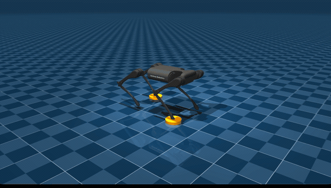

# Convex MPC for Quadruped Locomotion

[](https://github.com/Howard-Ryu-Brooklyn/MIT_Cheetah3_BYO/actions/workflows/ci.yml)
[](LICENSE)


An ideal single-rigid-body plant and a MuJoCo plant, behind **one plant interface**,
driven by **one controller**. Swapping the plant is a one-line change — which is the
whole point: the two simulators answer different questions, and running the same
controller against both tells you which of your assumptions the physics engine breaks.

| | asks |
|---|---|
| **SRB plant** (analytic) | Is the MPC algorithm itself correct, with nothing else varying? |
| **MuJoCo plant** (engine) | How robust is that linearization under real contact, friction and joint dynamics? |

The controller follows Di Carlo et al., *Dynamic Locomotion in the MIT Cheetah 3
Through Convex Model-Predictive Control* (IROS 2018): a 13-state single-rigid-body
model linearized about ZYX Euler angles, a QP over a 10-step horizon solved with OSQP,
Raibert footstep planning, and Bézier swing trajectories.

<!-- GIF 를 docs/media/trot.gif 에 넣은 뒤 아래 두 줄의 주석을 벗기면 된다.
<p align="center"></p>
-->

## Quickstart (about 60 seconds)

```bash
git clone https://github.com/Howard-Ryu-Brooklyn/MIT_Cheetah3_BYO.git
cd Convex-MPC
python -m venv .venv && source .venv/bin/activate    # Python 3.11+
make install                                          # pip install -e ".[mujoco,notebook,dev]"

make list                       # available gaits and scenarios
make run S=G_trot P=both        # trot at 1 m/s on both plants, side by side
make check                      # the physics tests (~5 s)
```

To watch it:

```bash
make view S=G_trot              # replay in the MuJoCo viewer, looping
make view S=G_gallop X=0.3      # gallop at 0.3x speed
```

> **macOS**: the MuJoCo passive viewer must be launched through `mjpython`
> (Cocoa requires the main thread). `make view` already does this. If you call the
> script directly, use `mjpython scripts/run_sim.py ... --view`.

`make run ... P=both` puts the two plants in adjacent columns — distance travelled,
lateral drift, roll/pitch RMS, peak torque split into stance and swing, plus the
assumption watchdogs (max swing phase, event re-solves, yaw step, command jump). It
reports numbers and lets you judge, rather than printing a pass/fail.

The gap between the two columns *is* the cost of linearization and idealization.
Something that only works on the SRB plant does not yet work.

## Repository layout

```
src/quadruped_mpc/
  core/          frames, time, geometry — unchanged when the robot changes
  control/       convex MPC, Raibert footsteps, swing trajectories, gait schedule
  plants/        srb.py (analytic) and mujoco_plant.py, behind plant_base.py
                 model_audit.py declares every intentional SRB↔MuJoCo mismatch
                 and raises on any undeclared one
  experiments/   scenario definitions and runners — no control logic lives here
  viz/           plots; nothing depends on this package
scripts/         entry points: run_sim.py, diagnostics, baseline capture
tests/           298 tests: unit, physical invariants, round-trips, golden traces
baselines/       golden trajectories the regression tests read
models/          the robot model (see models/mit_cheetah3/README.md)
docs/            architecture notes and the defect log
notebooks/       main.ipynb — visualization only, no algorithms
```

Dependencies run one way: `core` knows nothing of `control`, and `control` knows
nothing of `plants`. Only the runners assemble all three.

## Tests

```bash
make check       # physical correctness only — a red light here is a real problem
make check-all   # the above plus golden trajectory regression
make types       # mypy; an unchecked type annotation is just a comment
make accept      # you meant to change the physics: re-capture the baselines
```

Tests are layered on purpose. Unit tests pin one function's contract. **Physical
invariant** tests pin things that are true independently of the implementation —
energy conservation, `T = 2π√(l/g)`, the fact that swing legs carry exactly zero
force. Round-trip tests pin transform pairs (`FK(IK(p)) == p`). Golden tests are a
refactoring safety net, not a correctness claim: they lock in current behavior, so
they must be re-captured whenever you deliberately change the physics.

The distinction matters. `test_get_q_returns_same_angles_for_all_legs` used to pass
because the implementation copied `q1 = 0` to all four legs — the test had frozen the
bug. `FK(IK(p)) == p` is independently verifiable; "all four legs agree" was not.

## Scenarios

Scenario definitions live in `src/quadruped_mpc/experiments/scenarios.py`, split into
two tiers that must not be mixed:

- **`REGRESSION`** (`S0`–`S3`) — golden baselines depend on these. Changing a number
  here is not an experiment; it is a change of reference, and requires `make accept`.
- **`GALLERY`** (`G_*`) — nothing depends on these. They exist to be changed.

Anything can also be overridden from the command line without touching the file:

```bash
python scripts/run_sim.py --gait bounding --vx 2.0 --duration 2 --plant both
```

The aggressive gaits (`G_bound`, `G_gallop`) are **expected to fall over**. That is
the experiment: finding where a linearized MPC stops holding.

## Documentation

- [`docs/architecture.md`](docs/architecture.md) — the boundaries, and why they sit where they do
- [`docs/defects.md`](docs/defects.md) — thirteen defects found while hardening this code, and what each one taught
- [`models/mit_cheetah3/README.md`](models/mit_cheetah3/README.md) — the model is MIT Cheetah 3 dynamics with Unitree A1 visual meshes

Source comments and design docs are in Korean; this README and the code identifiers
are in English.

## License

MIT (see [`LICENSE`](LICENSE)). Redistributed third-party assets keep their own terms —
see [`NOTICE`](NOTICE).
